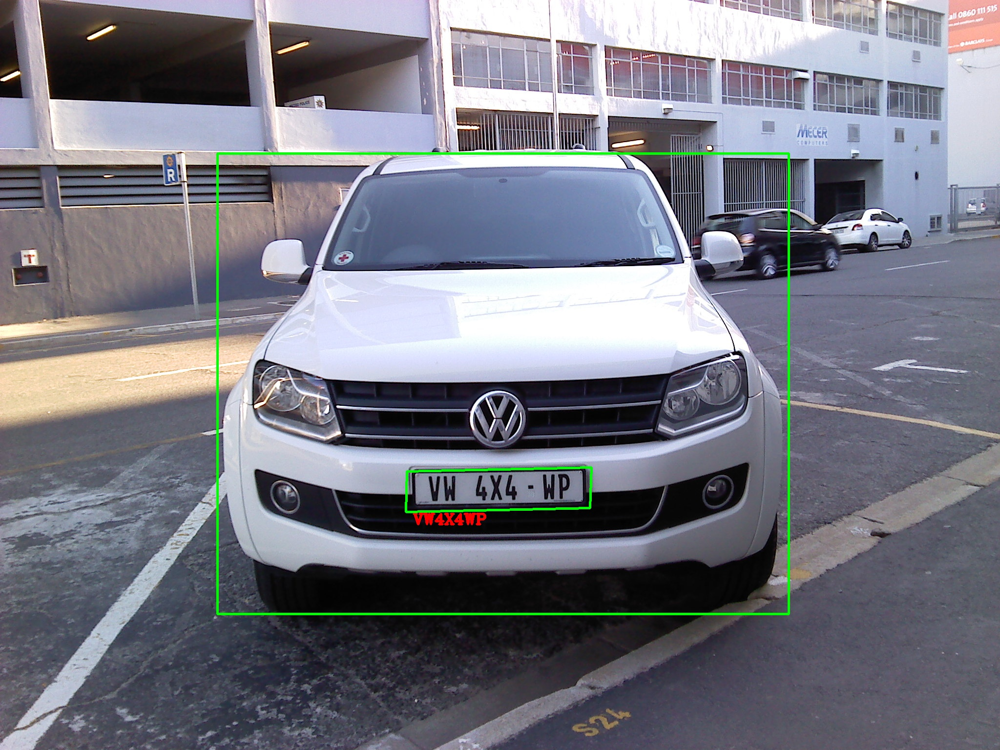

# Efficient ALPR in Unscontrained Scenarios

## Introduction

This repository contains the  implementation of the license plate algorithm. The OCR part of the algorithm used code from the ECCV 2018 paper "[License Plate Detection and Recognition in Unconstrained Scenarios](https://github.com/sergiomsilva/alpr-unconstrained)".The algorithms has improved the efficiency by more than 4 times.


## Requirements

In order to easily run the code, ,you must be compiled darknet、RoIAlign(for pytorch 1.0) and Corner_Pooling.
To build Darknet just type "make" in "darknet" folder,  RoIAlign and Corner_Pooling need to be installed 

```shellscript
$ cd darknet && make
$ cd lib/RoIAlign && python setup.py install
$ cd lib/py_utils/_cpools && python setup.py install
```

**The current version was tested in an Ubuntu 16.04 machine, with Pytorch 1.0,  and Python 3.6.**

## Use ALPR

We support demo for image/image folder.
First, download the models from [Baidu Drive](https://pan.baidu.com/s/1oYj2Amz59YbEzC7FgdC1lQ) and put them in ROOT/models/

For detection on images, run:

```shellscript
$ python demo.py --images /image_path/xxx.jpg   --model models/lpr_model.pth
```

We provide example images in ROOT/demo.if set up correctly , the output should look like
 


## Training the LP detector

To train the LP detector network from scratch, or fine-tuning it for new samples, you can use the lpr_train.py script.. To correctly reproduce our experiments, this folder must be filled with all the annotations provided in the training List, and weights from yolov3(initialization training) or lpr_model.pth(finetune training)

```shellscript
$ python lpr_train.py --data train.txt --weights yolov3.weights 
```

